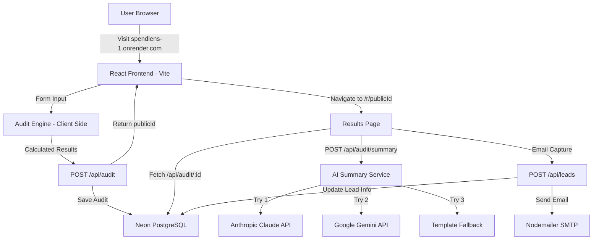

# ARCHITECTURE

## System Diagram

## Data Flow

1. **User lands on the home page** and clicks "Start Your Audit."
2. **Audit page** — They pick their AI tools, select plans, enter seats and monthly spend. This state is saved to localStorage so it survives page refreshes.
3. **Run Audit** — The client-side `auditEngine.js` runs all the calculations locally. No AI is used here — it's pure rule-based logic with real pricing data. This is intentional because the math needs to be deterministic and defensible.
4. **Save to DB** — The results are POSTed to the backend, which generates a unique `publicId` (nanoid) and stores everything in PostgreSQL via Prisma.
5. **Results page** — The user is redirected to `/r/{publicId}`. The page fetches the audit data from the backend. An AI summary is generated using Gemini (or Anthropic/fallback).
6. **Lead capture** — If the user enters their email, it's saved to the same audit record. A confirmation email is sent via SMTP.
7. **Shareable URL** — Anyone with the `/r/{publicId}` link can see the audit results. Email and company details are stripped from the public view.

## Why This Stack

| Choice | Why |
|---|---|
| **React + Vite** | Fast dev experience, great ecosystem, no SSR needed for a single-flow tool |
| **Express.js** | Simple, lightweight, pairs well with Prisma. Didn't need the overhead of NestJS or similar |
| **Prisma 7 + Neon PostgreSQL** | Prisma gives type-safe DB queries. Neon is free and serverless — perfect for a demo |
| **React Three Fiber** | Adds premium 3D visuals without leaving the React ecosystem. Lighter than Spline embeds |
| **Tailwind CSS** | Rapid styling with utility classes. Dark mode support via `class` strategy |
| **Framer Motion** | Clean entrance animations that make the app feel polished |

## What I'd Change for 10k Audits/Day

1. **Move audit calculations server-side** — Right now the audit engine runs in the browser. At scale, I'd move it to the backend so results are consistent and auditable.
2. **Add Redis caching** — Cache AI summaries for similar audit profiles so we're not hitting the LLM API for every request.
3. **Queue email sending** — Instead of sending emails synchronously in the request, push them to a job queue (BullMQ or similar) so the response is instant.
4. **CDN for frontend** — Put the static frontend behind Cloudflare or similar CDN for global low-latency access.
5. **Rate limiting per IP** — Current rate limiting is basic. At scale I'd use Redis-backed sliding window rate limiting and add hCaptcha for abuse protection.
6. **Database indexing** — Add indexes on `publicId` and `email` columns for faster lookups.
